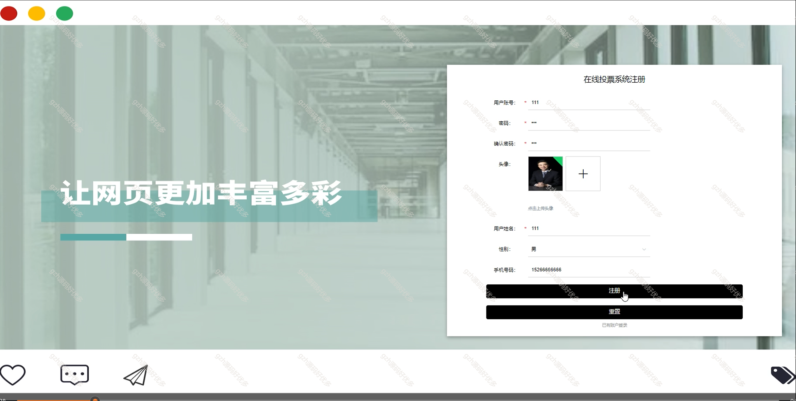
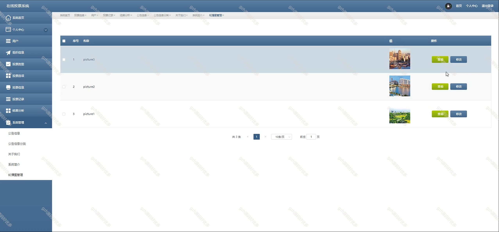
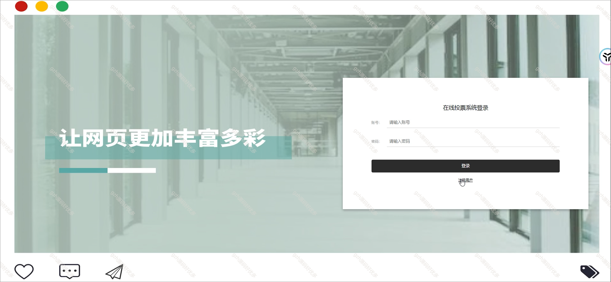
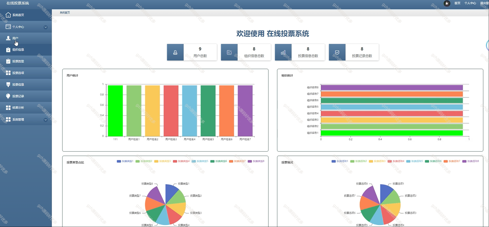
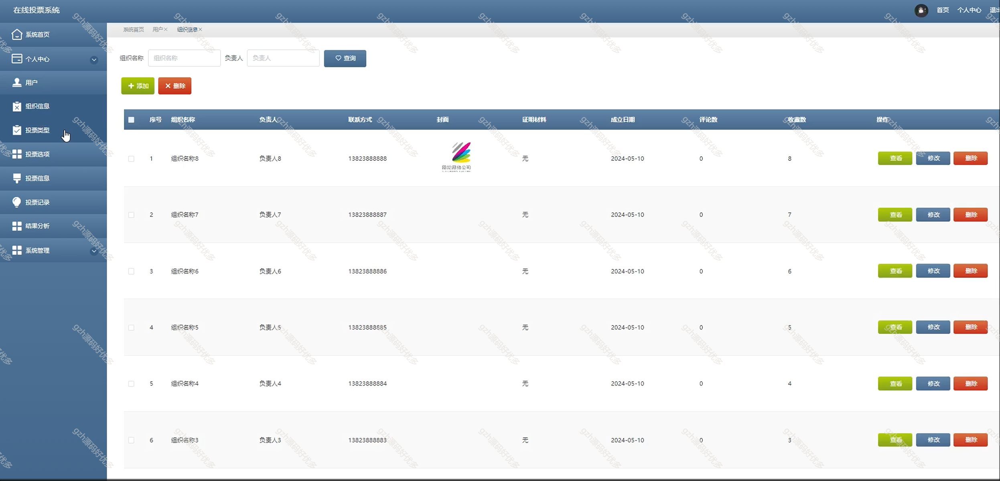
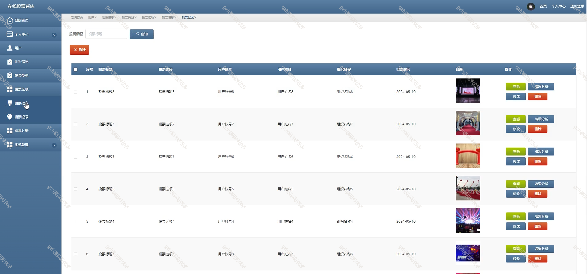
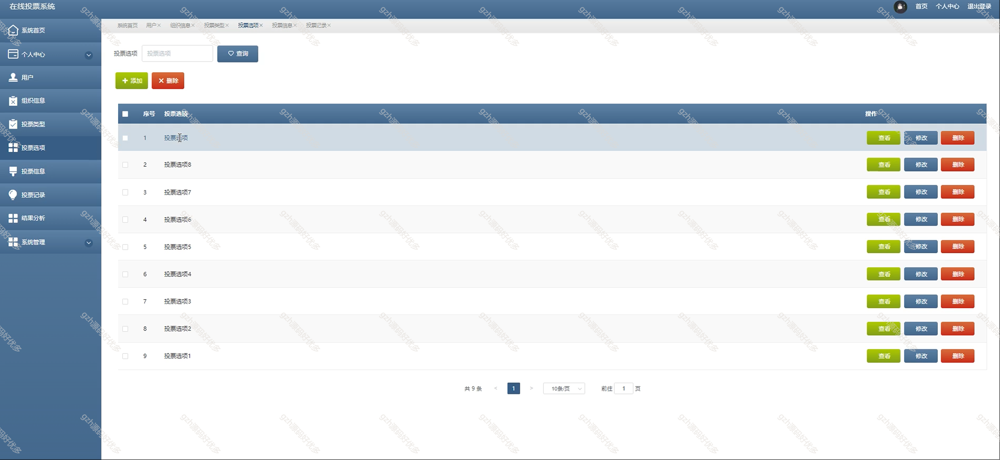
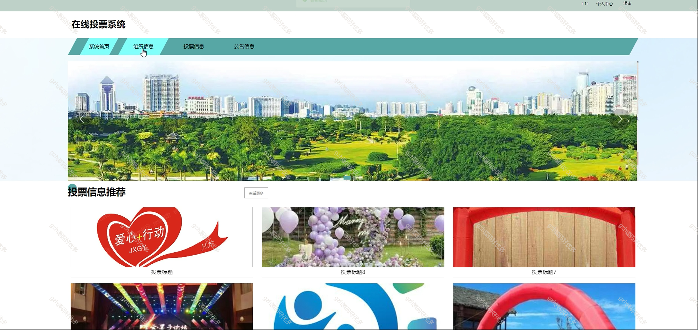
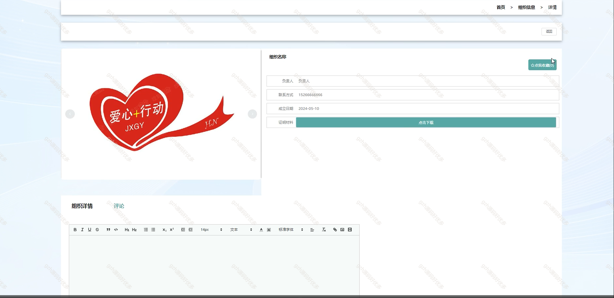

# springbootA365
springbootA365在线投票系统
 
## 查看主页获取源码

### 一、关键词

图文投票、投票系统

### 二、作品包含

源码+数据库+全套环境和工具资源+部署教程

### 三、项目技术

前端技术：Html、Css、Js、Vue2.0、Element-ui 
数据库：MySQL
后端技术：Java、SpringBoot2.0、MyBatis

  

### 四、运行环境

开发工具：IDEA/eclipse  + vscode

数据库：MySQL5.7（最低要5.7版本）

数据库管理工具：Navicat10以上版本

环境配置软件： JDK1.8 + Maven3.6.3

前端Nodejs：14

浏览器：谷歌浏览器

### 五、项目介绍

项目编号：springbootA365

在线投票系统是一种依托互联网投票形式，具备报名、互动、结果统计等功能，涵盖用户与投票活动管理及系统维护，通过网页平台实现，采用特定技术开发的应用系统 。

### 六、运行截图

